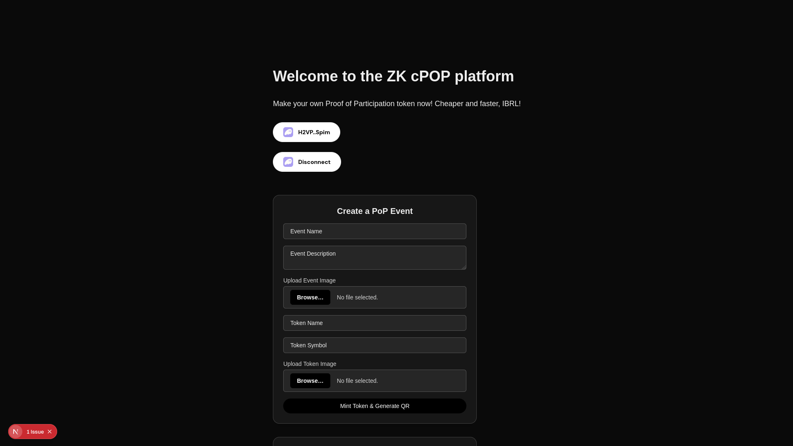
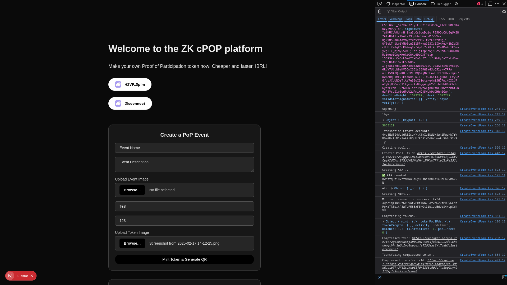

# zk-cpop-interface

## Summary

- Started the implementation a bit late, os not fully done
- Successfully figured out how to create a compressed token account using `PackedTokenTransferOutputData`.
- **QR code generation:**  
  - Not implemented yet.  
  - Will redirect to a serialized link with limited scope.  
  - Users will upload a selfie with the QR code (or with their username visible) for verification.
- **Airdrop logic:**  
  - Already implemented on the client side.  
  - Not yet imported or connected to the smart contract.
- **Submission & approval flow:**  
  - Users submit verification data to a storage layer like [Irys](https://irys.xyz).  
  - Event creators can review and approve submissions.  
  - Upon approval, the creator signs the airdrop transaction.
- **On-chain event creation:**  
  - Supports event name and description.  
  - ✅ Implemented  
  - 🔧 **To do:**
    - Add time-based metadata (e.g. start/end time).
    - Implement on-chain airdrop functionality.
    - Fix some dependencies issue with zerioze, which held up the Rust side.

## What works
- Minting Compressed token
- Compressed Transfer
- Event creation on-chain

## What doesn't work
- Airdrop not fully, clientside
- Let creator verify submissions
- Submission functionality for attendees
- QR code generation to link path, timebased serialization